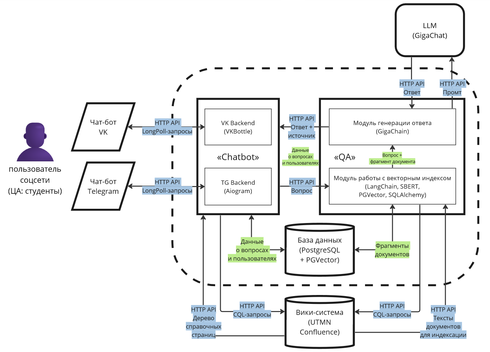

# Документация виртуального помощника студента ТюмГУ

## Общие сведения
 * **Наименование ИС:** Виртуальный помощник студента ТюмГУ
 * **Заказчик:** ФГАОУ ВО «Тюменский государственный университет», управление по сопровождению студентов «Единый деканат»
 * **Исполнитель:** Деканадзе Даниил Давидович, Низамов Тимур Дамирович (лицензия MIT)
 * **Назначение ИС:** предоставление обучающимся справочной информации из корпоративной вики-системы Confluence и ответы на произвольные вопросы посредством диалогов VK и Telegram

## Требования к функционалу проекта
 * **Обработка и отправка сообщений в чат-ботах:**
   * в параллельном режиме через LongPoll API должны работать чат-боты в VK и Telegram;
   * перед началом работы пользователь должен быть уведомлен об использовании ИИ для генерации ответов и обработке персональных данных;
   * пользователю должна быть предоставлена возможность подписки (отписки) на информационные сообщения;
   * параметры подключения к LongPoll API VK и Telegram задаются в переменных окружения.
 * **Предоставление справочной информации из структуры корпоративной вики-системы:**
   * по запросу пользователя чат-бот должен отправлять справочное меню, повторяющее структуру страниц основного пространства корпоративной вики-системы, имеющих тег (метку) «справка»;
   * если выбранная пользователем чат-бота страница содержит дочерние, вывести меню с дочерними страницами, иначе – текст страницы, включая параграфы, нумерованные и маркированные списки;
   * для уменьшения количества запросов к вики-системе необходимо использовать почасовое кеширование вызываемых пунктов меню (подменю и контента страниц);
   * кодовое название основного пространства Confluence задаётся в переменных окружения.
 * **Ответ на произвольные вопросы студентов с опорой на документы из корпоративной вики-системы:**
   * генерировать ответ на сообщение (вопрос) пользователя необходимо в случае, если выполняются все условия:
     * сообщение не соответствует командам чат-бота,
     * в сообщении больше 3 символов,
     * за последнюю минуту пользователь задал менее 3 вопросов;
   * при генерации ответов необходимо опираться на текст (фрагмент текста) документа из корпоративной вики-системы, в котором может быть ответ на вопрос пользователя, при этом документ не должен иметь дочерних страниц, в противном случае он является навигационным и не содержит полезных сведений;
   * документ вики-системы может представлять собой как HTML-страницу, так и PDF-файл с текстовым слоем;
   * допускается создание отдельного поискового хранилища текстов (фрагментов текстов) документов из вики-системы с частотой обновления не более 24 часов;
   * если ответа на вопрос пользователя нет, необходимо отправить пользователю сообщение с просьбой переформулировать вопрос или задать другой;
   * сообщение с ответом на вопрос должно содержать ссылку на источник в корпоративной вики-системе;
   * в случае получения ответа на вопрос, пользователю необходимо предложить оценить ответ: нравится/не нравится;
   * если генерация ответа в среднем занимает больше секунды, необходимо отправить пользователю сообщение с предупреждением о задержке, пока не будет готов ответ;
   * параметры подключения к сервису генеративной модели и корпоративной вики-системе задаются в переменных окружения.
 * **Накопление данных о пользователях и вопросах для последующей обработки:**
   * в базе данных должны храниться сведения о пользователях:
     * ИД VK или Telegram,
     * согласие на получение информационных сообщений;
   * в базе данных должны храниться сведения о заданных вопросах и полученных ответах:
     * текст вопроса,
     * текст ответа, если ответ не найден – пустая строка,
     * ссылка на источник в вики-системе, если ответ не найден – NULL,
     * оценка пользователя;
   * все записи в БД должны иметь поля времени создания и обновления.

## Архитектура приложения

*Рис. 1.* Архитектура приложения

Архитектура приложения (рис. 1) состоит из трёх составляющих: [микросервис работы с LongPoll API чат-ботов VK и Telegram (Chatbot)](chatbot.md), [микросервис ответа на вопрос по документам (QA)](qa.md), база данных. Каждая составляющая вынесена в отдельный Docker-контейнер.

Chatbot взаимодействует с API [вики-системы Confluence](confluence-integration.md) для получения справочной информации и LongPoll API VK и Telegram. QA взаимодействует с API вики-системы Confluence для получения документов при формировании векторного хранилища документов и API большой языковой модели сервиса GigaChat от Сбера для генерации ответов.

> [!IMPORTANT]
> В отдельный Docker-контейнер `db-migrate` вынесен сервис создания миграций баз данных. Синхронизация между базой данных и моделями ORM микросервисов должна осуществляться путём [миграций](https://alembic.sqlalchemy.org/en/latest/ops.html).

## Переменные среды
Пример файла с переменными среды представлен в [.env.example](../.env.example) в корне репозитория.

## См. также
1. [Интеграция с Confluence + инструкция по наполнению пространства](confluence-integration.md)
2. [Микросервис Chatbot](chatbot.md)
3. [Микросервис QA](qa.md)
