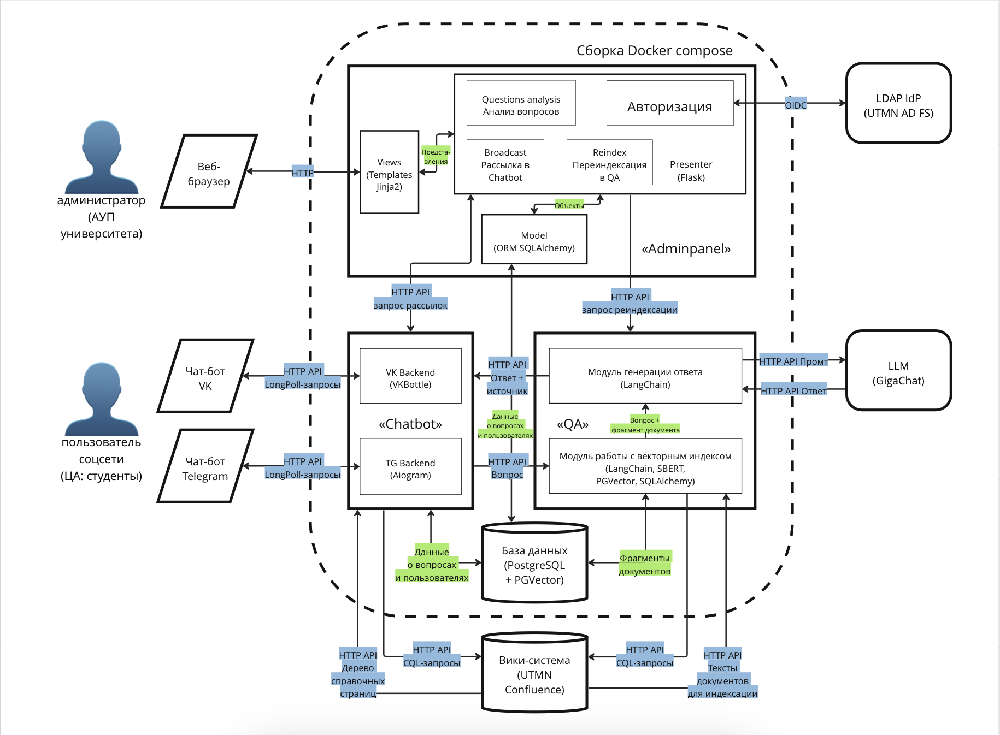

# Документация виртуального помощника студента ТюмГУ

## Функционал проекта
 * обработка и отправка сообщений в чат-ботах VK и Telegram
 * предоставление справочной информации из структуры корпоративной вики-системы
 * ответ на произвольные вопросы студентов с возможностью оценивания
 * накопление и обработка данных о пользователях и вопросах

## Архитектура приложения

*Рис. 1.* Архитектура приложения

Архитектура приложения состоит из трёх составляющих: [backend чат-ботов](chatbot.md), [микросервис поиска документов и генерации ответов (QA)](qa.md), база данных. Каждая составляющая вынесена в отдельный Docker-контейнер. Администраторская панель находится в разработке. 

Backend чат-ботов взаимодействует с API [вики-системы «Confluence»](confluence-integration.md) для получения справочной информации и LongPoll API VK и Telegram. QA взаимодействует с API вики-системы «Confluence» для получения документов при формировании векторного хранилища документов и API большой языковой модели сервиса «GigaChat» от Сбера для генерации ответов.

## Переменные среды
Пример файла с переменными среды представлен в [.env.example](../.env.example) в корне репозитория.

## См. также
1. [Интеграция с Confluence + инструкция по наполнению пространства](confluence-integration.md)
2. [Модуль Chatbot](chatbot.md)
3. [Модуль QA](qa.md)
