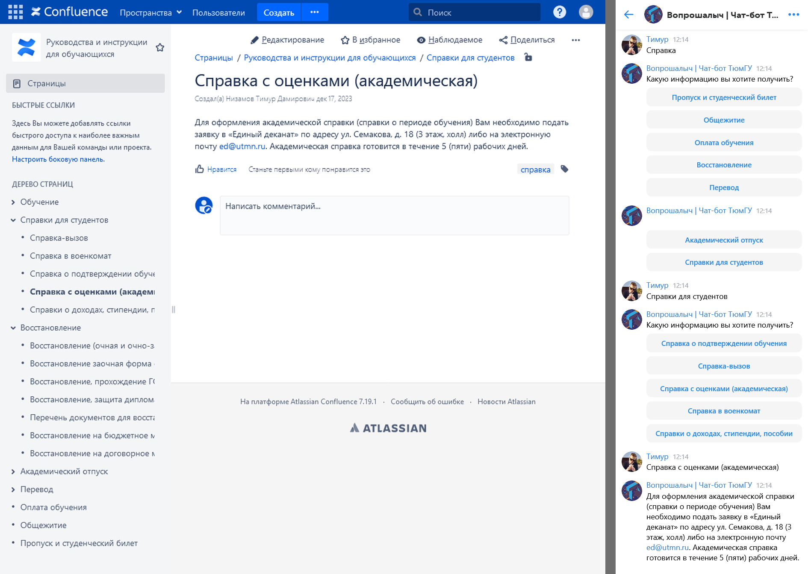

# Интеграция с Confluence
Confluence используется для формирования ответа на заданный пользователем вопрос и выдачи пользователю справочной информации.

Выгрузка справочной структуры в чат-бот осуществляется в режиме онлайн с использованием часового кеширования, т.е. структура дерева страниц и информация сохраняются в памяти чат-бота и не запрашиваются вновь из Confluence, если с момента прошлого запроса прошло менее часа.

Для ответов на вопросы документы подбираются не напрямую из Confluence, а из отдельной поисковой (векторной) базы данных, синхронизация с Confluence осуществляется 1 раз в сутки в 18:05.

## Требования к пространству на Confluence
Пространство на Confluence содержит страницы, чат-бот повторяет древовидную структуру страниц, настроенную на Confluence. Эта структура предусматривает вложенность страниц (одна страница может содержать другие страницы), что используется для навигации в чат-боте. 

**Страницы в пространстве могут содержать теги:**
 * "справка" — страницы с этим тегом будут отображены в кнопках чат-бота;
 * "навигация" — страницы с этим тегом не содержат информацию, полезную для ответов на вопросы, поэтому не учитываются при поиске документа для ответа на вопрос пользователя.

> [!IMPORTANT]
> Вложения могут быть только в виде PDF-файлов и должны быть машиночитаемыми, т.е. текст из них легко копируется в другие приложения, а не представляет собой "кракозябры".

### Пример


*Рис. 1.* Пример отображения структуры пространства в чат-боте

Рассмотрим пример (рис. 1) отображения структуры пространства в чат-боте VK (полностью аналогичен чат-боту в Telegram). При нажатии на кнопку "Справка" в чат-боте пользователю отправляются кнопки первого уровня дерева страниц на Confluence, при этом страница "Обучение" не предложена пользователю чат-бота, так как ей не присвоен тег "справка". 

При нажатии в чат-боте на одну из кнопок первого уровня (в примере это "Справки для студентов") пользователь получает кнопки второго уровня, вложенные в соответствующую страницу. При этом также могут быть страницы 3, 4 и последующих уровней. 

Если выбранная пользователем страница не имеет вложенных страниц (как, например, "Справка с оценками (академическая)"), чат-бот отправляет в диалог текст выбранной страницы.

Обратите внимание, что страница "Справка с оценками (академическая)" **не** имеет тег "навигация". Следовательно, она учтётся при подборе документа, по которому искусственный интеллект должен дать ответ, если пользователь задаст чат-боту произвольный вопрос (например, "Сколько готовится справка с оценками?").

## Конфигурация подключения к Confluence
Для подключения к Confluence задаются следующие переменные среды:
```
CONFLUENCE_TOKEN= # API-токен
CONFLUENCE_HOST= # URL-адрес вики-системы
CONFLUENCE_SPACES= # разделённые пробелом кодовые названия пространств, в которых хранятся документы для ответов на вопросы, структура первого в списке пространства продублируется в чат-боте
```
Переменные среды подтягиваются в файлах `config.py` и располагаются в классе `Config`. Файлы `config.py` содержатся в модулях `qa` и `chatbot`.

## Методы работы с Confluence (для разработчиков)

### Справочная структура (модуль `chatbot`)

TODO: write

### Создание векторного индекса страниц (модуль `QA`)

TODO: write
